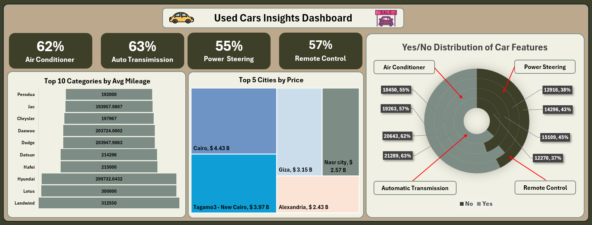
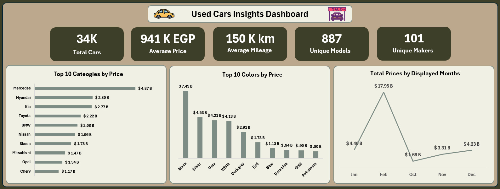

# Solution: Used Cars Excel Dashboard

This project presents an interactive Excel dashboard that analyzes the used cars market in Egypt using cleaned and structured data.

## Dashboard Page 1 – Market Overview

### Key KPIs
- Total number of cars listed
- Average car price (EGP)
- Average mileage
- Number of unique models and makers

### Visual Analysis
- Top 10 car categories by total price
- Top 10 colors by total price
- Total prices by selected months
- Overall market trends and distributions

This page provides a high-level overview of pricing behavior and popular characteristics in the market.

---

## Dashboard Page 2 – Detailed Insights

### Feature Distribution
- Air Conditioner availability
- Automatic transmission percentage
- Power steering availability
- Remote control availability

### Additional Insights
- Top brands by average mileage
- Top cities by total price contribution
- Yes/No distribution of car features

This page focuses on deeper insights related to features, geography, and usage patterns.

---

## Data Processing
- Raw data was cleaned and filtered
- Pivot tables were used to aggregate metrics
- Charts and KPI cards were created for visualization
- Dashboards were formatted for clarity and readability