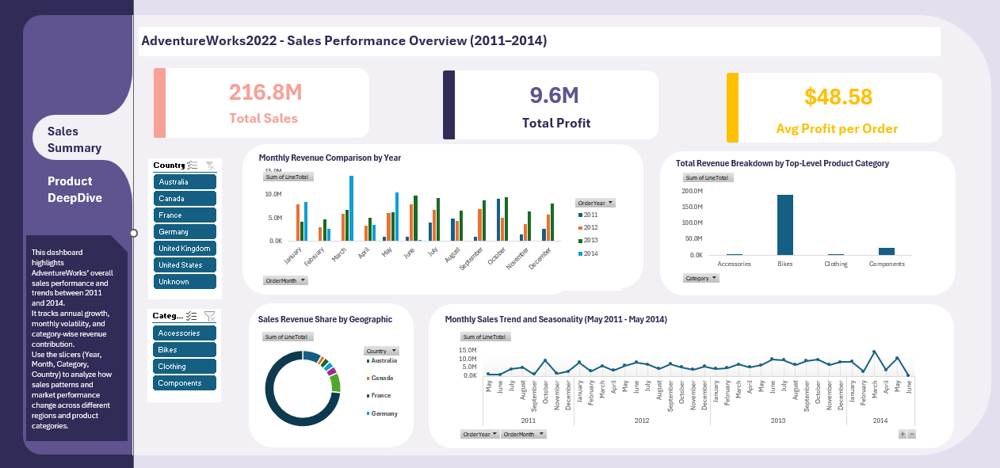
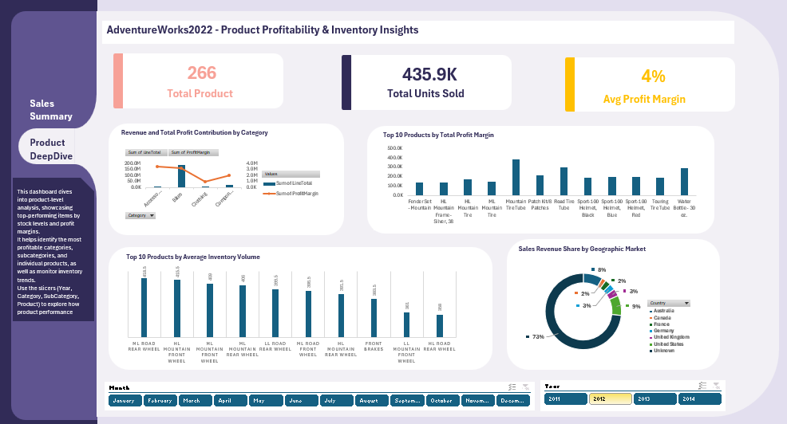

# Solution: AdventureWorks Sales & Product Dashboards

This project consists of two interactive Excel dashboards that analyze sales performance and product profitability using the AdventureWorks dataset.

---

## Dashboard 1 – Sales Performance Overview (2011–2014)

### Key KPIs
- Total Sales
- Total Profit
- Average Profit per Order

### Insights & Analysis
- Monthly revenue comparison across multiple years
- Sales revenue distribution by geographic market
- Revenue contribution by top-level product categories
- Identification of seasonality and long-term sales trends

This dashboard provides a high-level understanding of overall business performance and growth patterns.

---

## Dashboard 2 – Product Profitability & Inventory Deep Dive

### Key KPIs
- Total number of products
- Total units sold
- Average profit margin

### Product-Level Analysis
- Revenue and total profit contribution by category
- Top 10 products by total profit margin
- Top 10 products by average inventory volume
- Sales revenue share by geographic market

This dashboard focuses on identifying the most profitable products and understanding inventory behavior.

---

## Data Preparation & Modeling
- Sales and product data were cleaned and structured
- Calculated fields were used for profit and profit margin
- Pivot tables were created for aggregation
- Slicers were added for interactive filtering
- Dashboards were formatted for clarity and usability
