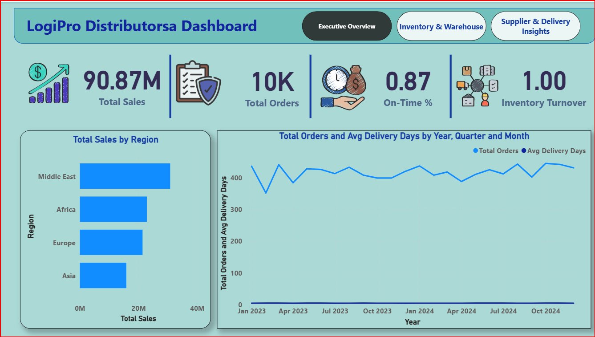
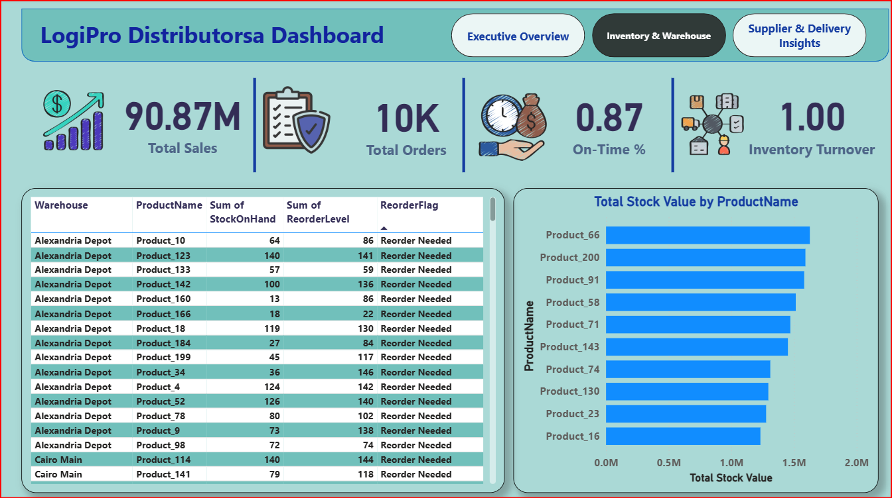
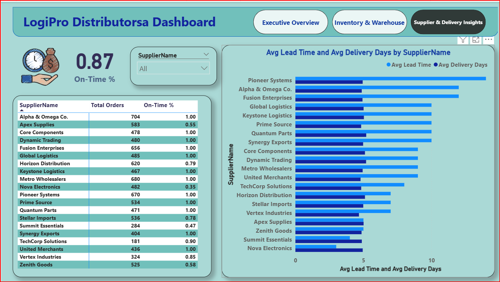

# Solution: LogiPro Distributorsa Dashboard

This project presents a multi-page Power BI dashboard designed to monitor business performance, inventory health, and supplier efficiency.

---

## Page 1 – Executive Overview

### Key KPIs
- Total Sales
- Total Orders
- On-Time Delivery Percentage
- Inventory Turnover

### Insights
- Sales performance across regions
- Order volume trends over time
- Overall delivery reliability

This page provides a high-level summary for executives to quickly assess business performance.

---

## Page 2 – Inventory & Warehouse Analysis

### Key Insights
- Stock on hand vs reorder levels by warehouse
- Identification of products requiring reorder
- Total stock value by product

This page helps monitor inventory risks and optimize warehouse operations.

---

## Page 3 – Supplier & Delivery Insights

### Supplier Performance
- Total orders by supplier
- On-time delivery percentage
- Average lead time and delivery days

This analysis highlights reliable suppliers and identifies potential supply chain bottlenecks.

---

## Data Modeling & Design
- Relationships were created between sales, inventory, and supplier tables
- Calculated measures were built using DAX
- Slicers were used for supplier and time-based filtering
- Dashboards were designed for clarity and operational usability
