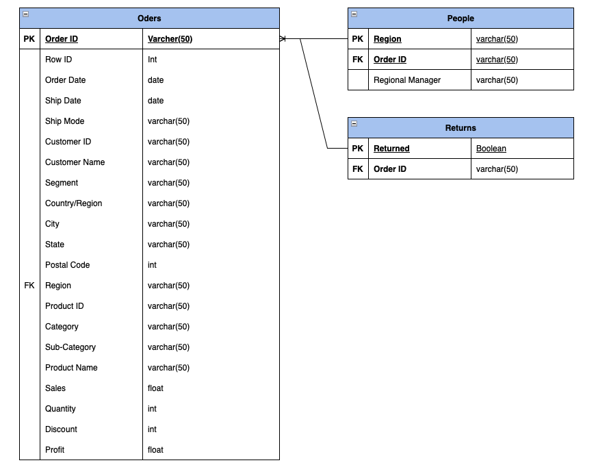
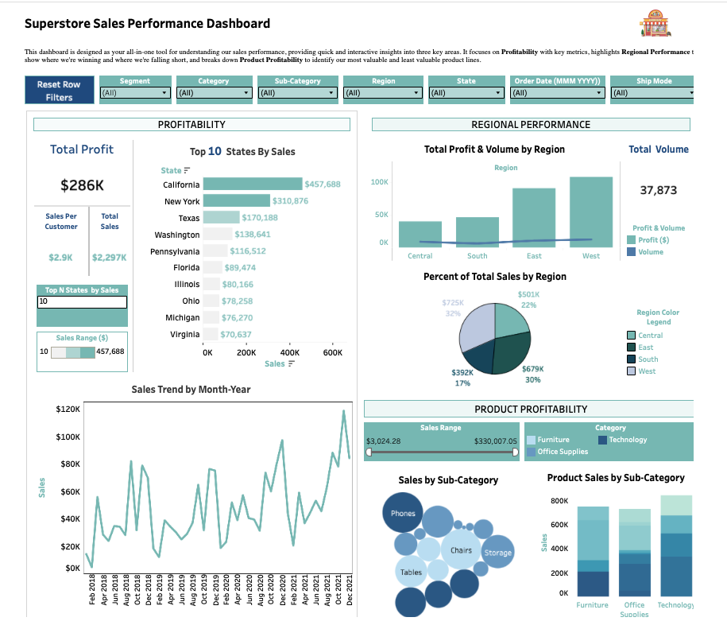

# Solution: Superstore Sales Performance Dashboard

This project presents an interactive Tableau dashboard designed to analyze sales performance, profitability, and regional trends.

---

## Data Model Overview

The data model consists of:
- Orders table containing transactional sales data
- Returns data linked by Order ID
- People table mapping regions to managers

Relationships were created using Order ID and Region fields.

---

## Dashboard – Sales Performance & Profitability

### Profitability Analysis
- Total profit, total sales, and sales per customer KPIs
- Top 10 states by total sales
- Product and sub-category profitability comparisons

### Regional Performance
- Total profit and sales volume by region
- Percentage contribution of each region to total sales

### Trend Analysis
- Sales trend by month and year
- Identification of seasonality and growth patterns

### Interactivity
- Filters for segment, category, sub-category, region, state, date, and ship mode
- Dynamic filtering to explore specific business scenarios

---

## Design & Implementation
- Calculated fields were used for profit metrics
- Parameters enabled dynamic analysis
- Dashboard layout was designed for clarity and storytelling
- Color encoding was used to highlight performance differences
